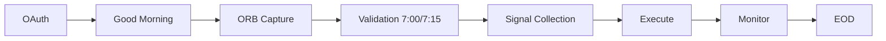

# Easy ORB 0DTE Strategy

**Automated dual-strategy system:** Opening Range Breakout (ORB) for ETFs + selective **0DTE options overlay** for convex amplification — built on **broker-only data**, multi-layer risk controls, and full position monitoring.

> **Positioning:** This repo is part of the "Easy Trading Software" suite — production-grade strategy execution + monitoring designed for reliability, reproducibility, and real-world constraints (rate limits, slippage, missing candles, broker quirks).

---

### New here?

| Goal | Where to go |
|------|-------------|
| **Run or deploy the app** | [Quick start](#quick-start) |
| **Understand the system** | [What it does](#what-it-does) · [Repository structure](#repository-structure) |
| **See proof & performance** | [Evidence](#evidence-validated-baseline) · [Performance & backtest](#performance--backtest) |
| **Risk & guardrails** | [Risk controls & guardrails](#risk-controls--guardrails) |
| **Full documentation** | [Documentation](#documentation) · [docs/](docs/) |
| **Cloud deploy** | [Deployment](#deployment) · [docs/Cloud.md](docs/Cloud.md) |

---

## Evidence (validated baseline)

**Historical validation (11 trading days, October 2024):**

| Metric | Value |
|--------|--------|
| **Weekly return** | **+73.69%** |
| **Winning days** | **10/11 (91%)** |
| **Max drawdown** | **-0.84%** (~96% reduction vs baseline) |
| **Profit factor** | **194.00** |
| **Monthly projection (compounded)** | **+508%** |

> Validation results reflect the documented test window and system configuration used at the time. Real-world performance will vary due to fills, spreads, latency, volatility regimes, and broker constraints. **This project is not financial advice.** See [Disclaimer](#disclaimer).

---

## What it does

This repository contains:

1. **Easy ORB 0DTE Strategy** — Main application (ORB capture → signal collection → execution → monitoring).  
   Deploys as a **single Cloud Run service**.

2. **easy0DTE** — Options overlay module (convex eligibility + execution) used only on the highest-conviction setups.

3. **easyCollector** — Standalone market snapshot collector (ORB / SIGNAL / OUTCOME) for US 0DTE + crypto (separate deploy).

**Core philosophy:**

- ORB captures breakouts from the first 15 minutes of market action.
- 0DTE overlay is selective: **"Gamma > Leverage."**
- Systems-first: guardrails, monitoring, repeatable execution, clean alerts.

---

## What is ORB + 0DTE?

**Opening Range Breakout (ORB)** uses the first minutes of the session (e.g. 15–60 minutes) to define a range (high/low). Breakouts above or below that range are used as trade signals — a well-known pattern in systematic equity and index trading (with variants across 15–60 minute buckets and different confirmation rules).

**0DTE (zero days to expiration)** options expire the same day. They offer high gamma and convexity: small moves in the underlying can produce large percentage moves in the option. They are also highly time-sensitive and can become worthless by expiry, so execution and risk controls are critical.

**This repo** combines both: ORB identifies high-conviction breakouts; the **easy0DTE** overlay applies 0DTE options only to a filtered subset of those signals (convex eligibility, strike selection, position sizing). The result is selective convex amplification with broker-only data and multi-layer risk controls.

---

## End-to-end flow (one minute)

Typical flow:

**OAuth → Good Morning → ORB Capture → validation candle (7:00/7:15) → Signal Collection → execution → monitoring → EOD**

Key timing (PT):

- **6:30–6:45** ORB capture window  
- **7:00 / 7:15** validation candle + signal collection window  
- **7:30** batch execution  
- **All day** monitoring + exits + reporting

### Architecture sequence



High-level sequence: **OAuth** → **ORB Capture** (6:30–6:45 PT) → **Validation candle** (7:00/7:15) → **Signal Collection** (ORB + 0DTE filters) → **Execution** (7:30) → **Position monitoring** (trailing, breakeven, exits) → **End-of-day** close and reporting. See [docs/ARCHITECTURE.md](docs/ARCHITECTURE.md) and [docs/Strategy.md](docs/Strategy.md) for detail.

---

## Risk controls & guardrails

Designed to reduce failure modes common in automated trading:

- **Risk engine & position sizing** — Caps, redistribution, safety floors, ADV-based slip guard.
- **Market condition / "red day" filtering** — Portfolio-level and signal-level controls to avoid trading in unfavorable regimes.
- **Duplicate prevention & trade persistence** — Idempotent behavior and state stored in GCS.
- **Exit system** — Trailing stops, breakeven logic, time-based and P&L-based exits, with a monitoring loop.
- **Holiday & low-liquidity avoidance** — Config-driven calendar and session checks.

For full detail: [docs/Risk.md](docs/Risk.md) and [docs/Strategy.md](docs/Strategy.md).

---

## Performance & backtest

| Placeholder | Description |
|-------------|-------------|
| **Equity curve** | Full equity curve and drawdown charts are maintained in internal docs and performance packs. |
| **Backtest overview** | Backtest methodology, windows, and assumptions are documented in [docs/Strategy.md](docs/Strategy.md). |
| **Win rate & summary** | Validated baseline metrics are in the [Evidence](#evidence-validated-baseline) section above. |

A full performance pack (tables, charts, sensitivity notes) lives in the production documentation and is not published in this public repo. Use the Evidence table and [docs/Strategy.md](docs/Strategy.md) for reproducibility context.

---

## Repository structure

```text
easyORBStrategy/
├── main.py                  # Application entry (local)
├── cloud_run_entry.py       # Cloud Run entry point
├── requirements.txt
├── Dockerfile
├── modules/                 # ORB strategy: data, risk, alerts, execution, GCS
├── configs/                 # Strategy configs + templates (*.template, strategies.env, modes/, etc.)
├── data/
│   ├── watchlist/           # core_list.csv, 0dte_list.csv, sentiment/orb mappings
│   ├── holidays_custom.json
│   └── holidays_future_proof.json
├── priority_optimizer/      # 89-point data collection and priority optimization
├── easy0DTE/                # Easy 0DTE Strategy (options overlay)
└── easyCollector/           # Market data collector (separate deploy)
```

---

## Quick start

**Config**

- Copy config templates from `configs/` and `easy0DTE/configs/`.
- Create your `.env` files with broker credentials and API keys.
- Do not commit secrets. See [.env.example](.env.example) for placeholder keys.

**Install**

```bash
pip install -r requirements.txt
```

(If using the overlay) install `easy0DTE/requirements.txt`.

**Run locally**

```bash
python main.py
```

(Cloud entry) `python cloud_run_entry.py`

**Collector**

See [easyCollector/README.md](easyCollector/README.md) for collector run + deploy (Polygon/Coinbase/Firestore).

---

## Documentation

| Doc | Purpose |
|-----|---------|
| [docs/ARCHITECTURE.md](docs/ARCHITECTURE.md) | System architecture + module organization |
| [docs/Strategy.md](docs/Strategy.md) | ORB strategy timing, validation, performance context |
| [docs/Risk.md](docs/Risk.md) | Risk controls, sizing, constraints |
| [docs/OAuth.md](docs/OAuth.md) | E*TRADE OAuth token management |
| [docs/Data.md](docs/Data.md) | Watchlists, ORB capture, data handling |
| [docs/Alerts.md](docs/Alerts.md) | Alert types + formatting |
| [docs/Cloud.md](docs/Cloud.md) | GCP Cloud Run deployment steps |
| **easyCollector** | [easyCollector/README.md](easyCollector/README.md), [easyCollector/EXECUTIVE_SUMMARY.md](easyCollector/EXECUTIVE_SUMMARY.md) |

---

## Deployment

- **ORB + 0DTE:** Build with root `Dockerfile`; deploy to Cloud Run using `cloud_run_entry.py` as entry.
- Set `GCP_PROJECT_ID`, region, and inject secrets using your secret manager.
- See [docs/Cloud.md](docs/Cloud.md).

---

## Disclaimer

**This repository is for educational and research purposes only. It does not constitute financial, investment, or trading advice.** Trading equities and options involves substantial risk of loss. Past performance (including the validated baseline above) does not guarantee future results. Fills, slippage, latency, and broker constraints will affect live results. You are solely responsible for your own trading and risk decisions. Always validate thoroughly in a simulation or demo environment before any live usage. Consult a qualified professional for advice specific to your situation.

---

## License

See [LICENSE](LICENSE) in this repository.

---

*Public repo. Set `GCP_PROJECT_ID` and your own secrets for deployment. Do not commit credentials. Revision history: [CHANGELOG.md](CHANGELOG.md).*
