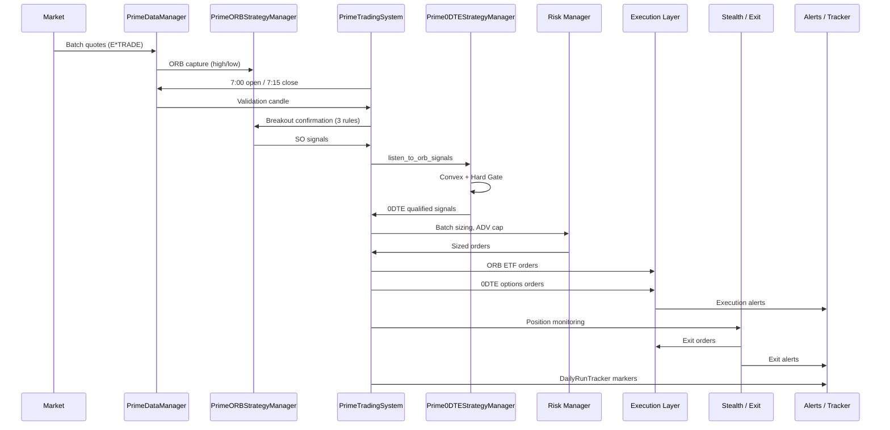
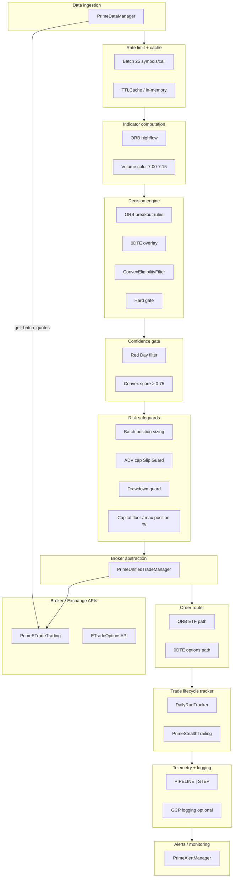

# Easy ORB 0DTE Strategy

**Automated dual-strategy system: Opening Range Breakout (ORB) for ETFs plus 0DTE options overlay for selective convex amplification—with broker-only data, multi-layer risk management, and full position monitoring.**

---

### **New here?**

| Goal | Where to go |
|------|-------------|
| **Run or deploy the app** | [Quick Start](#-quick-start) |
| **Understand the system** | [System Overview](#-system-overview) · [How It Works](#-how-it-works) |
| **Full documentation** | [Documentation](#-documentation) · [docs/README.md](docs/README.md) (docs index) |
| **Cloud deploy & URLs** | [docs/CloudSecrets.md](docs/CloudSecrets.md) · [Cloud Optimization Strategy](docs/Cloud.md#cloud-deployment-optimization-strategy) |
| **Daily flow & rules** | [ProcessFlow.md — Daily Performance Flow](docs/ProcessFlow.md#-daily-performance-flow--steps-the-software-takes) · [SignalRulesChecklist.md](docs/doc_elements/Sessions/2026/Feb24%20Session/SignalRulesChecklist.md) |
| **Cloud Scheduler jobs** | [CLOUD_JOBS_CHECKLIST.md](docs/doc_elements/Sessions/2026/Feb24%20Session/CLOUD_JOBS_CHECKLIST.md) — 7 required jobs (keepalives, 7:00 validation, 7:15 prefetch, EOD); verify/resume there. |

---

### **Version & status**

| Item | Value |
|------|--------|
| **Version** | Rev 00298 (Mar 2, 2026; execution path improvements—0DTE_MAX_POSITIONS alignment, _pending_dte0_signals init, PIPELINE logging); Rev 00297 (SIGNAL_COLLECTION_DIAG); Rev 00296 (dual-path list build); Rev 00295 (0DTE target_symbols); Rev 00293/00293+ (merge-on-persist, GCS load) — **DEPLOY PENDING** |
| **Status** | ✅ **Production Ready** — Dual Strategy (ORB ETF + 0DTE Options) |
| **Trading modes** | DEMO (Live ready when needed) |
| **Broker** | E*TRADE (default), Interactive Brokers, Robinhood (placeholders) |
| **Data** | **Broker-only** (no third-party sources) |
| **0DTE** | ✅ Production — Priority v1.1, direction-aware Red Day, delta 0.15–0.35 (Rev 00246) |
| **Cloud** | ✅ Automated weekly cleanup; scripts deployed with app (Rev 00294); [Optimization Strategy](docs/Cloud.md#cloud-deployment-optimization-strategy) |

---

## 🎯 **System Overview**

**Easy ORB 0DTE Strategy** is the application that runs a **dual-strategy automated trading system** combining:

1. **ORB ETF Trading**: Opening Range Breakout strategy for leveraged ETFs and stocks
2. **0DTE Options Trading**: Selective convex amplification of high-conviction ORB signals via 0DTE options

**Core Philosophy**: 
- **ORB Strategy**: Trade breakouts from the first 15 minutes of market action
- **0DTE Strategy**: *Not every ORB-qualified trade gets options—only the highest-conviction setups.*
- **Easy 0DTE = Selective Convex Amplification. Gamma > Leverage.**

**📋 Daily session flow:** For the exact steps the app runs each day (OAuth → Good Morning → ORB Capture → validation candle 7:00/7:15 → Signal Collection [rules + GCS persist/load] → execution → monitoring → EOD), see **[Daily Performance Flow](docs/ProcessFlow.md#-daily-performance-flow--steps-the-software-takes)** in [ProcessFlow.md](docs/ProcessFlow.md). To verify why you got 0 signals or confirm LONG/SHORT rules, use **[SignalRulesChecklist.md](docs/doc_elements/Sessions/2026/Feb24%20Session/SignalRulesChecklist.md)**. For Feb 24 session fixes (cross-instance signal list, current-day only, orb_data serialization), see [Feb24 Session](docs/doc_elements/Sessions/2026/Feb24%20Session/SESSION_SUMMARY_FEB24_2026.md). For Feb 26 fixes (signal append bug, Convex filter 0-pass diagnosis), see [Feb26 Session](docs/doc_elements/Sessions/2026/Feb26%20Session/SESSION_SUMMARY_FEB26_2026.md). For Feb 27 fixes (merge-on-persist, execution GCS load, ORB LONG rule breakdown), see [Feb27 Session](docs/doc_elements/Sessions/2026/Feb27%20Session/SESSION_SUMMARY_FEB27_2026.md) and [Signal Collection Flow](docs/doc_elements/Sessions/2026/Feb27%20Session/SIGNAL_COLLECTION_EXECUTION_FLOW.md). For Mar 2 fixes and improvements (0DTE target_symbols, dual-path list build, diagnostic logging, execution path verification), see [Mar02 Session Summary](docs/doc_elements/Sessions/2026/Mar02%20Session/SESSION_SUMMARY_MAR02_2026.md). **0 signals diagnosis:** [SIGNAL_COLLECTION_DIAGNOSTIC_LOGS.md](docs/doc_elements/Sessions/2026/Mar02%20Session/SIGNAL_COLLECTION_DIAGNOSTIC_LOGS.md) — grep commands for cloud logs.

---

### Dual-Strategy Integration (phases)

```
┌─────────────────────────────────────────────────────────────┐
│                 Easy ORB 0DTE Strategy                      │
│                  (ORB ETF + 0DTE Options)                   │
├─────────────────────────────────────────────────────────────┤
│  Phase 1: ORB Capture (6:30-6:45 AM PT) - SHARED          │
│  Phase 2: Signal Collection & Rules (7:15-7:30 AM PT)       │
│  Phase 3: Dual Trade Execution (7:30 AM PT)               │
│  Phase 4: Position Monitoring (Throughout Day)             │
└─────────────────────────────────────────────────────────────┘
```

## 📊 **Proven Performance**

### **Historical Validation - 11 Days Real Market Data (October 2024)**

**Overall Results:**
- **Weekly Return**: +73.69% (23% above +60% target)
- **Winning Days**: 10/11 (91% consistency)
- **Max Drawdown**: -0.84% (96% reduced from -21.68%)
- **Profit Factor**: 194.00 (vs 2.03 baseline)
- **Monthly Projection**: +508% (compounded)

**By Day Type Performance:**
| Type | Days | Baseline | Improved | Improvement |
|------|------|----------|----------|-------------|
| POOR | 3 | -49.75% | **+0.69%** | **+50.44%** |
| WEAK | 3 | -12.73% | **+3.08%** | **+15.81%** |
| GOOD | 3 | +57.12% | **+56.93%** | Preserved ✅ |

**Account Size Scaling:**
- **$1,000**: +73.69% weekly (validated)
- **$5,000**: +65-75% weekly (projected)
- **$50,000**: +60-70% weekly (projected)

---

### Key components

| Layer | ORB | 0DTE / shared |
|-------|-----|----------------|
| **Decision** | PrimeORBStrategyManager | Prime0DTEStrategyManager, ConvexEligibilityFilter |
| **Risk** | PrimeRiskManager / PrimeDemoRiskManager (batch sizing, ADV, drawdown) | Same risk layer; 0DTE position sizing in Prime0DTEStrategyManager |
| **Execution** | MockTradingExecutor (demo), PrimeUnifiedTradeManager + PrimeETradeTrading (live) | OptionsChainManager, ETradeOptionsAPI, MockOptionsExecutor |
| **Monitoring** | PrimeStealthTrailing (14 exit triggers) | Options exit manager (hard/time/profit stops) |
| **Data** | PrimeDataManager (get_batch_quotes), PrimeMarketManager | GCS persistence (validation candle, signal collection) |
| **Observability** | PrimeAlertManager (Telegram), DailyRunTracker (GCS markers), PIPELINE logging | Same |

---

## 🔄 Trade Lifecycle Flow


```mermaid
sequenceDiagram
  participant Market
  participant Data as PrimeDataManager
  participant ORB as PrimeORBStrategyManager
  participant Sys as PrimeTradingSystem
  participant DTE as Prime0DTEStrategyManager
  participant Risk as Risk Manager
  participant Exec as Execution Layer
  participant Monitor as Stealth / Exit
  participant Log as Alerts / Tracker

  Market->>Data: Batch quotes (E*TRADE)
  Data->>ORB: ORB capture (high/low)
  Sys->>Data: 7:00 open / 7:15 close
  Data->>Sys: Validation candle
  Sys->>ORB: Breakout confirmation (3 rules)
  ORB->>Sys: SO signals
  Sys->>DTE: listen_to_orb_signals
  DTE->>DTE: Convex + Hard Gate
  DTE->>Sys: 0DTE qualified signals
  Sys->>Risk: Batch sizing, ADV cap
  Risk->>Sys: Sized orders
  Sys->>Exec: ORB ETF orders
  Sys->>Exec: 0DTE options orders
  Exec->>Log: Execution alerts
  Sys->>Monitor: Position monitoring
  Monitor->>Exec: Exit orders
  Monitor->>Log: Exit alerts
  Sys->>Log: DailyRunTracker markers
```

---

## 🎯 **How It Works**

### **ORB ETF Trading Flow**

#### **Phase 1: ORB Capture (6:30-6:45 AM PT / 9:30-9:45 AM ET)**
- Capture opening range (high/low) for **all symbols** (ORB + 0DTE):
  - **ORB symbols**: 145 from `core_list.csv`
  - **0DTE symbols**: 111 from `0dte_list.csv` (merged with ORB, no duplicates)
  - **Total**: ~145 symbols captured (0DTE symbols already in ORB list are not duplicated)
- Triggered **at 6:45 AM PT** (ensures complete 6:30-6:45 range)
- Method: **E*TRADE batch quotes ONLY** (today's OHLC = ORB high/low) - Rev 00236
- **No Fallback**: System stops if broker fails (no third-party backup)
- Processing: 2-5 seconds for all symbols
- Data stored for entire trading day
- **Fully dynamic**: Add/remove symbols without code changes (both ORB and 0DTE)

#### **Phase 2: Signal Collection & Rules Confirmation (7:15-7:30 AM PT / 10:15-10:30 AM ET)** ⭐ PRIMARY

**Required Cloud Scheduler jobs (7):** keepalive-1/2/3, oauth-market-open-alert, **validation-candle-700** (7:00 AM PT), **prefetch-validation-715** (7:15 AM PT), end-of-day-report. All must be ENABLED. List/resume: [CLOUD_JOBS_CHECKLIST.md](docs/doc_elements/Sessions/2026/Feb24%20Session/CLOUD_JOBS_CHECKLIST.md).

**Signal rules at a glance (validation candle = 7:00–7:15 AM PT only):**
- **ORB LONG / 0DTE CALL (all 3):** Price ≥ ORB high×1.001; volume GREEN (7:15 close > 7:00 open); 7:00–7:15 close > ORB high.
- **ORB SHORT / 0DTE PUT (all 3):** Price ≤ ORB low×0.999; volume RED (7:15 close < 7:00 open); 7:00–7:15 close < ORB low.
- **Why 0 signals:** All NEUTRAL → fix 7:00 + 7:15 jobs and GCS. Validation OK but 0 signals → no symbol had bar close above ORB high (LONG) or below ORB low (SHORT); check logs for rule breakdown. **0DTE 0 qualified:** Convex filter rejected all → grep `CONVEX_FILTER | 0_eligible` for check-by-check failure counts. Full rules and diagnosis: [SignalRulesChecklist.md](docs/doc_elements/Sessions/2026/Feb24%20Session/SignalRulesChecklist.md), [SESSION_SUMMARY_FEB26_2026.md](docs/doc_elements/Sessions/2026/Feb26%20Session/SESSION_SUMMARY_FEB26_2026.md).

**ORB Strategy - SO Signal Collection:**
- **7:00 open**: Cloud Scheduler job `validation-candle-700` captures 7:00 open (batched 25/call), persisted to GCS. **7:15 prefetch**: Trading loop or scheduler job `prefetch-validation-715` builds 7:00 open + 7:15 close → GREEN/RED (E*TRADE batch quotes - Rev 00236).
- **Scanning**: Continuous validation every 30 seconds (15-minute window)
- **Validation**: 3 strict rules (price, volume color, validation candle close vs ORB high/low)
- **Rules Confirmation**: After ORB Capture, confirms all rules before execution
- **Risk Management**: Position sizing, capital allocation, rank-based multipliers
- **Final Collection**: 6-15 **confirmed SO trades** ready for execution (after all rules and risk management)
- **Ranking**: Multi-factor priority scoring (VWAP 27%, RS vs SPY 25%, ORB Vol 22%)
- **Data Source**: **E*TRADE batch quotes ONLY** (2-5 seconds vs 131.6s with third-party)

**0DTE Strategy - Options Signal Collection:**
- **Signal Reception**: Receives ORB signals during SO Signal Collection window
- **Rules Confirmation**: After ORB Capture, confirms all rules before execution
  - Convex Eligibility Filter (score ≥ 0.75, 8 criteria)
  - Strategy selection (long call, debit spread, etc.)
  - Strike selection (delta, premium, liquidity validation)
  - Position sizing (capital allocation, max position limits)
- **Risk Management**: Hard gate validation, liquidity checks, position size validation
- **Final Collection**: **Confirmed 0DTE options trades** ready for execution (after all rules and risk management)
- **ORB Data Usage**: Uses ORB Capture data for eligibility filtering and signal generation

**Signal Collection Alert (7:30 AM PT):**
- **Single Alert** showing both SO Signal Collection and 0DTE Signal Collection
- **SO Signal Collection**: Final confirmed SO trades list (after all rules and risk management)
- **0DTE Signal Collection**: Final confirmed 0DTE options trades list (after all rules and risk management)
- Both lists represent **final execution-ready trades** confirmed to open positions

#### **Phase 3: Dual Trade Execution (7:30 AM PT / 10:30 AM ET)** ⭐ PRIMARY

**ORB SO Execution:**
- **Execution**: Trades from **SO Signal Collection** (final confirmed list) executed simultaneously
- **Position Sizing**: Rank-based multipliers (3.0x, 2.5x, 2.0x...) already applied during Signal Collection
- **Capital Deployment**: 90% allocation via normalization (already calculated)
- **Trade Limit**: Maximum 15 concurrent positions (already validated)
- **Capital Efficiency**: 85-93% with whole shares
- **Execution Alert**: **Separate ORB SO Execution alert** sent with executed trades

**0DTE Options Execution:**
- **Execution**: Trades from **0DTE Signal Collection** (final confirmed list) executed
- **Options Chain**: Fetched from E*TRADE API for each confirmed symbol
- **Strike Selection**: Already validated during Signal Collection (delta, premium, liquidity)
- **Position Sizing**: Already calculated during Signal Collection (capital allocation, max limits)
- **Trade Limit**: Maximum 15 concurrent positions (already validated)
- **Execution Alert**: **Separate 0DTE Options Execution alert** sent with executed trades

**Note**: Both execution alerts sent **after** trades are executed. The Signal Collection alert contains the **final confirmed trade lists** ready for execution (after all rules and risk management).

#### **Phase 4: Position Monitoring (Throughout Day)**
- **Frequency**: Every 30 seconds
- **Breakeven**: Auto-activate at +0.75% profit after 6.4 min
- **Trailing**: Dynamic 1.5-2.5% based on volatility, activates at +0.7% after 6.4 min
- **Exits**: 14 automatic triggers (all configurable)
- **Capture Rate**: Expected 85-90% with optimized settings

### **0DTE Options Trading Flow**

#### **ORB Capture (6:30-6:45 AM PT)** ⭐ SHARED WITH ORB STRATEGY
- **Shared ORB Capture**: All 0DTE symbols (111) included in ORB Capture
- **ORB Data**: 0DTE symbols merged with ORB symbols (no duplicates)
- **Data Storage**: ORB high/low/range stored for all symbols (ORB + 0DTE)
- **Single Alert**: **ORB Capture Complete alert** sent with data for both SO trades and 0DTE trades
- **ORB Data Usage**: Used for 0DTE signal generation and eligibility filtering

#### **Rules Confirmation & Signal Collection (7:15-7:30 AM PT)** ⭐ FINAL CONFIRMED LIST
- **Signal Reception**: Receives ORB signals from `PrimeORBStrategyManager` during SO Signal Collection window
- **Rules Confirmation**: After ORB Capture, confirms all rules before execution:
  - Convex Eligibility Filter (score ≥ 0.75, 8 criteria)
  - Strategy selection (long call, debit spread, etc.)
  - Strike selection (delta, premium, liquidity validation)
  - Hard gate validation (open interest, bid/ask spread, volume)
  - Position size validation (capital allocation, max limits)
  - Red Day check (portfolio-level protection)
- **Risk Management**: All risk checks applied (position limits, capital constraints, liquidity requirements)
- **Final Collection**: **0DTE Signal Collection** - Final confirmed 0DTE options trades ready for execution
- **Signal Collection Alert**: **Single alert** showing both SO Signal Collection and 0DTE Signal Collection (final confirmed lists)

#### **Convex Eligibility Filter** (8 Criteria - All Must Pass)

**Minimum Eligibility Score**: 0.75 (75%)

1. **Volatility Score** (40% weight): ≥ Top 20% percentile (80th percentile)
2. **ORB Range/ATR** (25% weight): ≥ 0.35% OR 5-min ATR ≥ 0.25%
3. **NOT Red Day** (15% weight): Direction-aware Red Day check (Rev 00246)
   - **LONG (CALL) trades**: Rejected on Red Days
   - **SHORT (PUT) trades**: Allowed and encouraged on Red Days (perfect for PUT trades)
4. **ORB Break** (Required): Long: price > ORB High, Short: price < ORB Low
5. **Volume Confirmation** (Required): Current volume > ORB volume average
6. **VWAP Condition** (Required): Long: Price ≥ VWAP, Short: Price ≤ VWAP
7. **Momentum Confirmation** (10% weight): Positive MACD, RS vs SPY, or VWAP distance
8. **Market Regime** (10% weight): Trend/impulse (NOT rotation)

**Rejection**: Signal rejected if score < 0.75

**Diagnosis when 0 pass (Rev 00292):** Logs show check-by-check failure counts, grep-friendly `CONVEX_FILTER | 0_eligible | total=N | top_failures: ...`, and top 5 per-symbol rejection details. See [SESSION_SUMMARY_FEB26_2026.md](docs/doc_elements/Sessions/2026/Feb26%20Session/SESSION_SUMMARY_FEB26_2026.md).

#### **Signal Generation & Strategy Selection (7:30 AM PT)**

**Strategy Selection Matrix** (based on momentum score and ORB range):
- **Momentum ≥ 80, ORB Range ≥ 0.40%**: Long Call/Put (delta 0.15, premium $0.15-$0.60) - Rev 00238
- **Momentum ≥ 70, ORB Range ≥ 0.35%**: Momentum Scalper (ATM, quick expansion)
- **Momentum 45-70, ORB Range ≥ 0.25%**: ITM Probability Spread (delta 0.65, higher probability)
- **Momentum 55-80** (default): Debit Spread (delta 0.15-0.30, most common)
- **Momentum < 45**: No Trade (low momentum/chop detected)

**Target Symbols**: 111 symbols from `0dte_list.csv` (Tier 1: 23, Tier 2: 88)
- **Priority**: SPX, QQQ, SPY, IWM, MAGS (Tier 1)
- **Others**: MAG-7, AI/SEMI leaders, thematic/sector momentum (Tier 2)

**Strike Selection** (Rev 00246 - Expanded Delta Range):
- **Long Calls/Puts**: Delta 0.15 (cheap OTM for gamma explosion), Premium $0.15-$0.60
- **Debit Spreads**: Delta 0.15-0.35 (expanded from 0.15-0.30, based on volatility), Premium $0.15-$0.60 per leg
  - SPX/QQQ/SPY: Delta up to 0.30 (high volatility)
  - Other symbols: Delta up to 0.35 (high volatility opportunities)
- **Spread Width**: $1-$2 (QQQ/SPY), $5-$10 (SPX)

**Execution**:
- Options chain fetched from E*TRADE API (real-time)
- Strike selection based on strategy type and target delta
- Liquidity validation (bid/ask spread ≤ 5%, open interest ≥ 100)
- Position sizing based on allocated capital (Tier 1: 35%, Tier 2: 20%, Tier 3: 10%)
- Up to 15 positions (matches ORB Strategy)

#### **Position Management (Throughout Day)** - Rev 00238

**Real-Time Options Price Tracking** (Rev 00238 - Critical):
- Options prices updated every 30 seconds from E*TRADE API
- Position values updated with real options prices (not underlying price movement)
- Exit decisions based on actual options P&L (captures 300-400%+ moves)
- **Example**: QQQ moves +0.86% → Option moves from $0.19 to $0.97 (+410%)

**Exit Framework** (Priority Order):
1. **Fail-Safe** (highest priority): -60% absolute stop, liquidity degradation, spread widening
2. **Hard Stops**: -45% for debit spreads, -55% for lottos (premium-based protection)
3. **Invalidation Stops**: VWAP/ORB reclaim, momentum shift (structural stops)
4. **Time Stops**: 25 minutes (debit spreads), 12 minutes (lottos) - theta decay prevention
5. **Profit Targets**: +60% → sell 50%, +120% → sell 25%, runner trails until exit conditions

**Automated Profit Management**:
- **First Target**: +60% → Sell 50% of position (lock in profits, reduce risk)
- **Second Target**: +120% → Sell 25% of remaining position (further profit locking)
- **Runner**: Trails remaining position until VWAP/ORB reclaim or time cutoff (capture extended moves)

**End of Day**: All positions closed at 12:55 PM PT (5 minutes before market close)

---

## 🏗 System Architecture

### System summary

The system is built for production: a single broker-only data path (E*TRADE), no third-party market-data dependencies, and fail-safe behavior when the broker is unavailable. Risk is enforced in layers: capital allocation and max position caps in configuration; drawdown and daily-loss guards and safe mode in `PrimeRiskManager` / `PrimeDemoRiskManager`; ADV-based exposure caps (Slip Guard) and batch position sizing before any order is sent. Latency is handled by async batch quoting (`PrimeDataManager.get_batch_quotes`, 25 symbols per call), a configurable main-loop interval, and GCS-backed persistence so validation candle and signal collection state survive restarts and multi-instance runs. Observability is built in: structured `PIPELINE | STEP` logs for cloud diagnosis, `DailyRunTracker` (GCS markers for ORB capture, signal collection, execution), `PrimeAlertManager` (Telegram for alerts and execution summaries), and optional GCP logging.

### Section A — Executive architecture


```mermaid
flowchart LR
  subgraph MarketData["Market Data"]
    DM[PrimeDataManager]
    GCS1[GCS Persistence]
  end
  subgraph FeaturePipeline["Feature Pipeline"]
    ORB[ORB Capture]
    VC[Validation Candle 7:00/7:15]
  end
  subgraph DecisionEngine["Decision Engine"]
    ORBM[PrimeORBStrategyManager]
    DTE[Prime0DTEStrategyManager]
  end
  subgraph RiskLayer["Risk Layer"]
    RM[PrimeRiskManager / PrimeDemoRiskManager]
  end
  subgraph ExecutionLayer["Execution Layer"]
    ETF[MockTradingExecutor / PrimeETradeTrading]
    OPT[Options Executor]
  end
  subgraph Observability["Observability"]
    ALERT[PrimeAlertManager]
    TRACK[DailyRunTracker]
    LOG[PIPELINE logging]
  end

  MarketData --> FeaturePipeline
  FeaturePipeline --> DecisionEngine
  DecisionEngine --> RiskLayer
  RiskLayer --> ExecutionLayer
  ExecutionLayer --> Observability
```

### Section B — Technical architecture


```mermaid
flowchart TB
  subgraph Broker["Broker / Exchange APIs"]
    ET[PrimeETradeTrading]
    ETO[ETradeOptionsAPI]
  end

  subgraph DataIngestion["Data ingestion"]
    DM[PrimeDataManager]
    DM --> |get_batch_quotes| ET
  end

  subgraph RateCache["Rate limit + cache"]
    BATCH["Batch 25 symbols/call"]
    CACHE["TTLCache / in-memory"]
  end

  subgraph Indicators["Indicator computation"]
    ORB_DATA["ORB high/low"]
    VOL["Volume color 7:00-7:15"]
  end

  subgraph Decision["Decision engine"]
    ORB_RULES["ORB breakout rules"]
    DTE_OVERLAY["0DTE overlay"]
    CONVEX[ConvexEligibilityFilter]
    HARD[Hard gate]
  end

  subgraph ConfidenceGate["Confidence gate"]
    RED[Red Day filter]
    CONVEX_SCORE["Convex score ≥ 0.75"]
  end

  subgraph RiskSafeguards["Risk safeguards"]
    BATCH_SIZE["Batch position sizing"]
    ADV_CAP["ADV cap Slip Guard"]
    DD[Drawdown guard]
    CAP_FLOOR["Capital floor / max position %"]
  end

  subgraph BrokerAbstraction["Broker abstraction"]
    UTM[PrimeUnifiedTradeManager]
    UTM --> ET
  end

  subgraph OrderRouter["Order router"]
    ORB_EXEC["ORB ETF path"]
    DTE_EXEC["0DTE options path"]
  end

  subgraph Lifecycle["Trade lifecycle tracker"]
    DRT[DailyRunTracker]
    STEALTH[PrimeStealthTrailing]
  end

  subgraph Telemetry["Telemetry + logging"]
    PIPELINE["PIPELINE | STEP"]
    GCP_LOG["GCP logging optional"]
  end

  subgraph Alerts["Alerts / monitoring"]
    AM[PrimeAlertManager]
  end

  DataIngestion --> RateCache
  RateCache --> Indicators
  Indicators --> Decision
  Decision --> ConfidenceGate
  ConfidenceGate --> RiskSafeguards
  RiskSafeguards --> BrokerAbstraction
  BrokerAbstraction --> OrderRouter
  OrderRouter --> Lifecycle
  Lifecycle --> Telemetry
  Telemetry --> Alerts
```

## 🚀 **Key Features**

### **1. Multi-Layer Red Day Detection** 🚨 ⭐ Rev 00233 - ENHANCED

**Two-Layer Protection System:**

#### **Layer 1: Portfolio-Level Red Day Detection** (Pre-Execution)
**Enhanced Pattern Detection with 3-Tier Override System**:
- **Pattern 1**: OVERSOLD (RSI <40) + WEAK VOLUME (<1.0x)
- **Pattern 2**: OVERBOUGHT (RSI >80) + WEAK VOLUME (<1.0x)
  - **3-Tier Override**: MACD+RS → Solo MACD → VWAP Distance
- **Pattern 3**: WEAK VOLUME ALONE (≥80% of signals)

**Impact**: Prevents trading on losing days, saves $400-1,600/year

#### **Layer 2: Signal-Level Red Day Detection** ⭐ **NEW (Rev 00233)**
**Individual Trade Filtering**:
- Filters signals with: Weak volume + (Oversold RSI OR No momentum OR Negative VWAP)
- Prevents losing trades while allowing winning trades
- Two-layer protection: Portfolio + Signal level

#### **Layer 3: Post-Execution Health Checks** (Every 15 Minutes)
- **Red Flags**: Win rate <35%, Avg P&L <-0.5%, Low momentum, All positions losing
- **Actions**: EMERGENCY (3+ flags) → Close ALL, WARNING (2 flags) → Close weak positions

#### **Layer 4: Individual Position Protection**
- **Permanent Floor Stops**: Based on ORB volatility (2-8% stops)
- **Maintained for entire trade**: Breakeven/trailing can move up but NEVER below floor

---

### **2. Slip Guard - ADV-Based Position Capping** 🛡️ ⭐

**Prevents Slippage at Any Account Size:**

- Daily ADV refresh at 6:00 AM PT (90-day rolling average)
- Caps positions exceeding 1% of symbol's ADV
- **Reallocates freed capital** proportionally to top signals
- Maintains exact 90% deployment at all account sizes
- Scales to $10M+ accounts safely

**Example ($500K Account):**
```
MUD (Rank 3): $36.5K → Capped at $12K (1% of $1.2M ADV)
Freed: $24.5K → Redistributed to top signals

Result: 
✅ No slippage (MUD trades safely)
✅ Top signals get MORE capital
✅ All 15 trades execute
✅ 90.0% exact deployment
```

---

### **3. Greedy Capital Packing with Adaptive Fair Share** ⭐ BREAKTHROUGH

**Maximizes Trading Opportunities:**

Dynamic trade selection that fits as many high-priority trades as possible within capital constraints. Automatically adapts to extreme cases.

**Adaptive System Handles:**
- **$500 account, 30 signals, 60% expensive** → 12 trades ✅
- **$500 account, 30 signals, 90% expensive** → 3 trades ✅
- **$1,000 account, 10 signals, 3 expensive** → 7 trades, 88% deployed ✅
- **$50,000 account, 15 signals, all affordable** → 15 trades, 90% deployed ✅

**Results:**
- **Up to 15 trades** from 30 signals (vs 7-10 with fixed caps)
- **Capital Efficiency**: 85-90% with whole shares
- **57% more opportunities captured**

---

### **4. Batch Position Sizing with Normalization** ⭐ Rev 00090

**Complete 6-Step Flow:**

1. **Apply Rank Multipliers** (3.0x, 2.5x, 2.0x, 1.71x, 1.5x, 1.2x, 1.0x)
2. **Apply Max Position Cap** (35% default)
3. **Apply ADV Limits** (Slip Guard - 1% ADV cap)
4. **Normalize to Target Allocation** (90% default)
5. **Constrained Sequential Rounding** (whole shares)
6. **Post-Rounding Redistribution** ⭐ NEW - Redistributes unused capital

**Position Sizing Examples:**

| Account | Signals | Rank #1 | Rank #5 | Rank #15 | Deployed |
|---------|---------|---------|---------|----------|----------|
| **$1K** | 7 | $190 (19%) | $103 (10%) | - | $850-900 (85-90%) |
| **$5K** | 15 | $543 (11%) | $309 (6%) | $217 (4%) | $4,000-4,250 (80-85%) |
| **$50K** | 15 | $5,427 (11%) | $3,093 (6%) | $2,171 (4%) | $40,000-45,000 (80-90%) |

---

### **5. Multi-Factor Signal Ranking** ⭐ Rev 00109 v2.1 - DATA-PROVEN

**Prioritization Algorithm** (Deployed Nov 6, 2025):

**Formula v2.1**:
- ✅ **VWAP Distance**: 27% (↑ +2% - exceptional +0.772 correlation)
- ✅ **RS vs SPY**: 25% (strong +0.609 correlation)
- ✅ **ORB Volume**: 22% (↑ +2% - moderate +0.342 correlation)
- ⚠️ **Confidence**: 13% (↓ -2% - weak +0.333 correlation)
- ✅ **RSI**: 10% (context-aware)
- ⚠️ **ORB Range**: 3% (↓ -2% - minimal contribution)

**Result**: System prioritizes market leaders (high RS vs SPY) with institutional support (above VWAP).

---

### **6. Entry Bar Protection** 🛡️ ⭐ CRITICAL (Rev 00135)

**Permanent Floor Stops Based on Actual ORB Volatility:**

- **ORB Data Collection**: Captures actual high/low from 6:30-6:45 AM PT
- **Volatility Calculation**: `(ORB_high - ORB_low) / ORB_low × 100`
- **Permanent Floor Stops** (maintained for ENTIRE trade):
  - **9%+ volatility**: 8% EXTREME stop
  - **6-9% volatility**: 8% EXTREME stop
  - **3-6% volatility**: 5% HIGH stop
  - **2-3% volatility**: 3% MODERATE stop
  - **<2% volatility**: 2% LOW stop
- **Key Innovation**: Breakeven and trailing can move up but NEVER below floor
- **No Time Limit**: Protection maintained for entire trade duration

**Benefits:**
- ✅ Prevents 64% of immediate stop-outs
- ✅ Saves reversal trades
- ✅ Efficient stops for low-volatility entries

---

### **7. 0DTE Options Strategy** 🔮 ⭐ INTEGRATED (Rev 00238)

**Selective Convex Amplification - Optimized for Maximum Gamma Explosion**

#### **Strategy Overview**

**Core Philosophy**: *"Not every ORB-qualified trade gets options—only the highest-conviction setups."*

**Symbol List**: 111 symbols from `data/watchlist/0dte_list.csv`
- **Tier 1** (23 symbols): Core Daily 0DTE (SPX, SPY, QQQ, IWM, MAGS, VIX, IBIT, GLD, SLV + leverage ETFs)
- **Tier 2** (88 symbols): All others (MAG-7, AI/SEMI leaders, thematic/sector momentum, high-beta/retail)

**ORB Data Integration** (Rev 00209):
- All 0DTE symbols included in ORB capture (6:30-6:45 AM PT)
- 0DTE symbols merged with ORB symbols (no duplicates)
- ORB data used for signal generation and eligibility filtering

#### **Convex Eligibility Filter**
- **8 Criteria** (all must pass): Volatility (40%), ORB Range/ATR (25%), NOT Red Day (15%), ORB Break (Required), Volume (Required), VWAP (Required), Momentum (10%), Trend Day (10%)
- **Minimum Score**: 0.75 (75%)
- **Selective**: Only top 20% volatility signals qualify

#### **Strategy Types** (Rev 00238 - Optimized)

**Strategy Selection Matrix**:
| Momentum | ORB Range | Strategy | Strike | Premium | Capital |
|----------|-----------|----------|--------|---------|---------|
| ≥ 90 | ≥ 0.50% | Lotto | OTM (delta 0.15) | $0.15-$0.60 | 35% |
| ≥ 80 | ≥ 0.40% | **Long Call/Put** | OTM (delta 0.15) | $0.15-$0.60 | 40% |
| ≥ 70 | ≥ 0.35% | Momentum Scalper | ATM (1-2 OTM) | $0.20-$0.60 | 100% |
| 45-70 | ≥ 0.25% | ITM Probability | ITM (delta 0.65) | Higher | 100% |
| 55-80 | Default | **Debit Spread** | OTM (delta 0.15-0.30) | $0.15-$0.60 | 100% |
| < 45 | Any | No Trade | N/A | N/A | N/A |

**Primary Strategies**:
- **Long Calls/Puts** (Rev 00238 - Optimized): Momentum ≥ 80, ORB Range ≥ 0.40%, Delta 0.15, Premium $0.15-$0.60
  - **Example**: QQQ 628c @ $0.19 → $0.97 (+410% if QQQ moves +0.86%)
  - **Optimization**: Lowered premium minimum from $0.20 to $0.15, adjusted delta from 0.40 to 0.15 (OTM for gamma explosion)
- **Debit Spreads** (Most Common): Momentum 55-80, Delta 0.15-0.35 (Rev 00246 - expanded from 0.15-0.30), Spread Width $1-$2 (QQQ/SPY), $5-$10 (SPX)

#### **Real-Time Options Price Tracking** (Rev 00238 - Critical)

**Before** (Rev 00237):
- Exit decisions based on underlying price movement
- Misses actual options moves (e.g., +410% moves)

**After** (Rev 00238):
- Options prices updated every 30 seconds from E*TRADE API
- Exit decisions based on actual options P&L (not underlying price)
- Captures high-return trades (300-400%+ moves)

**Implementation**:
- `ETradeOptionsAPI.get_option_quote()`: Fetches real-time bid/ask for specific contracts
- `OptionsTradingExecutor.update_positions_with_real_prices()`: Updates all positions every 30 seconds
- Position values calculated from real options prices (single-leg, spreads)
- Exit decisions (profit targets, hard stops) based on actual options P&L

#### **Risk Management**
- **Max Positions**: 15 (matches ORB Strategy)
- **Max Position Size**: 35% of account equity
- **Capital Allocation**: Tiered (Tier 1: 35%, Tier 2: 20%, Tier 3: 10%)
- **Hard Stops**: -45% (debit spreads), -55% (lottos)
- **Time Stops**: 25 minutes (debit spreads), 12 minutes (lottos)
- **Fail-Safe**: -60% absolute stop

#### **Profit Management**
- **First Target**: +60% → Sell 50% of position (lock in profits)
- **Second Target**: +120% → Sell 25% of remaining position (further profit locking)
- **Runner**: Trails until VWAP/ORB reclaim or time cutoff (capture extended moves)
- **Exit Decisions**: Based on actual options P&L (Rev 00238)

#### **Recent Optimizations** (Rev 00238)

**Long Call Optimization**:
- Premium minimum: $0.20 → $0.15 (allows $0.19 entries like successful trades)
- Target delta: 0.40 → 0.15 (OTM for maximum gamma explosion)
- **Validation**: Strategy aligns with high-return trades (QQQ +300%, IWM +460%)

**Real-Time Price Tracking**:
- Options quotes fetched every 30 seconds from E*TRADE API
- Position values updated with real options prices
- Exit decisions based on actual options P&L (not underlying price movement)

**See [easy0DTE/docs/README.md](easy0DTE/docs/README.md) for complete 0DTE Strategy documentation.**

---

## 📱 **Alert System**

### **Daily Alerts**

**Morning (6:30-7:30 AM PT):**
1. ✅ **Good Morning Alert** (5:30 AM PT) - Token status and system ready
2. ✅ **ORB Capture Complete** (6:45 AM PT) - **Single alert** with ORB data for both SO trades and 0DTE trades
   - All symbols captured (145 ORB + 111 0DTE, merged)
   - ORB high/low/range stored for all symbols
3. ✅ **Signal Collection** (7:30 AM PT) - **Single alert** showing both final confirmed trade lists:
   - **SO Signal Collection**: Final confirmed SO trades (after all rules and risk management) - ready for execution
   - **0DTE Signal Collection**: Final confirmed 0DTE options trades (after all rules and risk management) - ready for execution
   - Both lists represent **final execution-ready trades** confirmed to open positions
4. ✅ **SO Execution** (7:30 AM PT) - **Separate alert** for executed ORB ETF trades
   - Shows trades executed from SO Signal Collection
5. ✅ **0DTE Options Execution** (7:30 AM PT) - **Separate alert** for executed 0DTE options trades
   - Shows trades executed from 0DTE Signal Collection
   - Strategy types (long call, debit spread, etc.)
   - Strike selection and delta achieved
   - Trade IDs (shortened format: `DEMO_QQQ_260109_628_c_704400`)

**Throughout Day:**
6. ✅ **ORB Position Exits** - Individual or aggregated alerts
7. ✅ **0DTE Position Exits** (Rev 00238) - Individual exits with **real-time options P&L**
   - Partial profit alerts (+60%, +120%)
   - Runner exit alerts
   - Exit decisions based on actual options prices (not underlying)
8. ✅ **Health Check Alerts** - Portfolio health monitoring (every 15 min if issues)

**End of Day:**
9. ✅ **EOD Close Alert** (12:55 PM PT) - Aggregated alerts for ORB and 0DTE positions (separate)
10. ✅ **ORB End-of-Day Report** (1:05 PM PT / 4:05 PM ET) - Daily ETF performance summary (Cloud Scheduler only)
11. ✅ **0DTE End-of-Day Report** (1:05 PM PT / 4:05 PM ET) - Daily options performance summary (Cloud Scheduler only)
    - Total options P&L (based on actual options prices)
    - Strategy breakdown (long calls, debit spreads, etc.)
    - Win rate and best/worst trades

**All alerts delivered via Telegram with clear formatting.**  
**Alert Formatting**: Rev 00231/00232 - Enhanced formatting with bold key metrics, shortened trade IDs

---

## 📚 **Documentation**

### **Core documentation**

| Doc | Purpose |
|-----|---------|
| **[docs/README.md](docs/README.md)** | **Docs index** — entry point for all supporting docs |
| **[docs/ProcessFlow.md](docs/ProcessFlow.md)** | End-to-end daily flow (OAuth → ORB Capture → Signal Collection → Execution → EOD) |
| **[SignalRulesChecklist.md (Feb24 Session)](docs/doc_elements/Sessions/2026/Feb24%20Session/SignalRulesChecklist.md)** | Rules checklist — verify LONG/SHORT success, diagnose 0 signals |
| **[docs/Strategy.md](docs/Strategy.md)** | ORB strategy, timing, validation candle, performance |
| **[docs/Risk.md](docs/Risk.md)** | Risk management, position sizing, capital allocation |
| **[docs/Alerts.md](docs/Alerts.md)** | Alert system (Telegram, types, formatting) |
| **[docs/ARCHITECTURE.md](docs/ARCHITECTURE.md)** | System architecture and module organization |

### **0DTE strategy**

| Doc | Purpose |
|-----|---------|
| **[easy0DTE/docs/README.md](easy0DTE/docs/README.md)** | 0DTE comprehensive guide (convex filter, strategy types, symbols) |
| **[easy0DTE/docs/Strategy.md](easy0DTE/docs/Strategy.md)** | 0DTE strategy details and workflow |
| **[easy0DTE/docs/Alerts.md](easy0DTE/docs/Alerts.md)** | 0DTE alert types and formats |

### **Supporting docs**

| Doc | Purpose |
|-----|---------|
| **[docs/Data.md](docs/Data.md)** | Data management and 89-point collection |
| **[docs/Cloud.md](docs/Cloud.md)** | Google Cloud deployment (shareable guide); [Optimization Strategy](docs/Cloud.md#cloud-deployment-optimization-strategy) |
| **[docs/CloudSecrets.md](docs/CloudSecrets.md)** | Project-specific: deploy commands, service URLs, cleanup |
| **[docs/OAuth.md](docs/OAuth.md)** | Token management and renewal |
| **[docs/Settings.md](docs/Settings.md)** | Configuration (65+ settings) and secrets |
| **[priority_optimizer/README.md](priority_optimizer/README.md)** | 89-point data collection system |

---

## 🚀 **Quick Start**

### **Prerequisites**

- Python 3.8+
- E*TRADE API credentials
- Telegram bot token (for alerts)
- Google Cloud account (for cloud deployment)

### **Install and run locally**

```bash
# Clone and enter the strategy folder
git clone <repository-url>
cd "0. Strategies and Automations/1. The Easy ORB Strategy"

# Install dependencies
pip install -r requirements.txt

# Configure environment (copy template, then edit with your keys)
cp configs/base.env.template configs/base.env
# Edit configs/base.env with API keys and settings

# OAuth tokens (required for E*TRADE)
# Web app: https://easy-trading-oauth-v2.web.app
# Management: https://easy-trading-oauth-v2.web.app/manage.html (Access: easy2025)
```

### **Run the app (demo mode)**

```bash
# Run Easy ORB 0DTE Strategy in demo mode
python main.py --strategy-mode standard --system-mode signal_only --etrade-mode demo

# 0DTE is enabled when ENABLE_0DTE_STRATEGY=true in easy0DTE/configs/0dte.env
```

### **Configuration**

**ORB Strategy**: `configs/strategies.env`, `configs/risk-management.env`, `configs/position-sizing.env`  
**0DTE Strategy**: `easy0DTE/configs/0dte.env`

**Key Settings:**
- `SO_CAPITAL_PCT=90.0` (ORB allocation)
- `ENABLE_0DTE_STRATEGY=true` (Enable 0DTE options)
- `0DTE_MAX_POSITIONS=15` (Max 0DTE positions)
- `MAX_CONCURRENT_POSITIONS=15` (Max ORB positions)

---

## ☁️ **Deployment**

**Cloud project:** The **Easy ORB Strategy**, **Easy 0DTE Strategy**, and **Easy Collector** are deployed to GCP project **`easy-etrade-strategy`**. See [docs/CloudSecrets.md](docs/CloudSecrets.md) for full deploy commands, service URLs, and project-specific scripts.

### **Google Cloud Run Deployment**

The container uses **`cloud_run_entry.py`** as the entrypoint: it starts a minimal HTTP server on `PORT` immediately (so Cloud Run’s startup probe passes), then runs the full ORB + 0DTE app. This avoids startup timeouts from slow OAuth/config init.

```bash
# From project root: build with Cloud Build (no local Docker required)
gcloud config set project easy-etrade-strategy
gcloud builds submit --tag gcr.io/easy-etrade-strategy/easy-etrade-strategy:latest .
gcloud run deploy easy-etrade-strategy \
  --image gcr.io/easy-etrade-strategy/easy-etrade-strategy:latest \
  --region us-central1 --platform managed \
  --allow-unauthenticated
# Production deploy uses service account, env vars, --no-cpu-throttling: see docs/CloudSecrets.md
```

**Optional:** `./scripts/deploy_safe.sh` (reads config; see [docs/CloudSecrets.md](docs/CloudSecrets.md) for full command)

### **Current Deployment Status**

- **Service**: `easy-etrade-strategy`
- **Region**: `us-central1`
- **Service URL**: `https://easy-etrade-strategy-223967598315.us-central1.run.app`
- **Status**: ✅ **LIVE** (revision and traffic % in [Cloud Console](https://console.cloud.google.com/run?project=easy-etrade-strategy))
- **Full deploy command** (service account, env vars, `--no-cpu-throttling`): [docs/CloudSecrets.md](docs/CloudSecrets.md) § Build and deploy

---

## ⚙️ **Configuration System**

### **Unified Configuration** (Rev 00201)

**65+ Configurable Settings** - No hardcoded values:

- **Capital Allocation**: `configs/strategies.env`
- **Position Sizing**: `configs/position-sizing.env`
- **Risk Management**: `configs/risk-management.env`
- **Exit Settings**: `configs/risk-management.env`
- **0DTE Strategy**: `easy0DTE/configs/0dte.env`

**Configuration Architecture** (Rev 00202):
- **System Defaults**: `configs/*.env` (version controlled)
- **User Overrides**: `.env` (gitignored)
- **Secrets**: `secretsprivate/` (local) or Google Secret Manager (production)

---

## 🔐 **Security & Secrets Management**

### **Two-Tier Secrets Management**

**Production** (Google Cloud):
- **Google Secret Manager**: All production credentials
- **OAuth Tokens**: Stored securely, auto-renewed daily
- **API Keys**: E*TRADE, Telegram tokens

**Local Development**:
- **`secretsprivate/` folder**: Gitignored local credentials
- **Templates**: `secretsprivate/*.env.template` (safe to commit)
- **Never Commit**: Actual `.env` files with real credentials

**See [docs/Settings.md](docs/Settings.md) for complete secrets management guide.**

---

## 📊 **Data Collection & Optimization**

### **89-Point Data Collection System** (Rev 00231)

**Comprehensive Trade Data:**
- **Technical Indicators**: RSI, MACD, Bollinger Bands, ATR, Moving Averages
- **Trade Execution Data**: Entry/exit prices, timing, P&L
- **Ranking Data**: Priority scores, eligibility scores, momentum scores
- **Risk Data**: Position sizes, stop losses, risk metrics
- **Market Conditions**: Volume, volatility, VWAP, RS vs SPY

**Collection Points:**
- **Signal Collection**: 7:15 AM PT (all signals, eligible and rejected)
- **Trade Execution**: 7:30 AM PT (executed trades)
- **Trade Exit**: Throughout day (exit triggers and performance)

**Storage**: Google Cloud Storage (`gs://easy-etrade-strategy-data/priority_optimizer/`)

**See [priority_optimizer/README.md](priority_optimizer/README.md) for details.**

---

## 🎯 **Trading Modes**

### **Demo Mode** (Default)

**ORB Strategy:**
- **Account Balance**: $1,000 (separate from 0DTE)
- **Mock Execution**: Simulated trades with realistic P&L tracking
- **Data Persistence**: GCS (`demo_account/mock_trading_history.json`)

**0DTE Strategy:**
- **Account Balance**: $5,000 (separate from ORB)
- **Mock Execution**: Simulated options trades with P&L tracking
- **Data Persistence**: GCS (`demo_account/mock_options_history.json`)

### **Live Mode**

- **Broker Integration**: E*TRADE API (ETF and Options)
- **Real Execution**: Actual trades
- **OAuth Integration**: Secure token management
- **Account Management**: Separate accounts supported

---

## 🔄 **Integration Points**

### **ORB ↔ 0DTE Integration**

- **Signal Flow**: ORB signals → Convex Filter → 0DTE signals
- **Red Day Filter**: Shared portfolio-level protection
- **Alert System**: Integrated signal collection, separate execution alerts
- **Data Collection**: Shared 89-point data collection system
- **Risk Management**: Shared position limits (15 max positions each)

---

## 📈 **Expected Performance**

### **ORB Strategy**
- **Weekly Return**: +73.69% (validated baseline)
- **Expected**: +450-550% with optimizations (+$3,000-8,000/year)
- **Win Rate**: 91% winning day consistency

### **0DTE Strategy** (Rev 00238)

**Symbol Coverage**: 111 symbols from `0dte_list.csv` (Tier 1: 23, Tier 2: 88)

**Strategy Types**:
- **Long Calls/Puts**: Momentum ≥ 80, ORB Range ≥ 0.40%, Delta 0.15, Premium $0.15-$0.60 (Rev 00238 - Optimized)
- **Debit Spreads**: Momentum 55-80, Delta 0.15-0.35 (Rev 00246 - expanded), Spread Width $1-$10 (Most Common)
- **Momentum Scalpers**: Momentum ≥ 70, Quick expansion expected
- **ITM Probability Spreads**: Momentum 45-70, Higher probability trades

**Performance Optimizations** (Rev 00238):
- **Long Call Optimization**: Premium $0.15-$0.60, Delta 0.15 (OTM for gamma explosion)
- **Real-Time Price Tracking**: Options prices updated every 30 seconds (accurate exit decisions)
- **Successful Trade Validation**: Strategy aligns with high-return trades (QQQ +300%, IWM +460%)

**Expected Performance**:
- **Selective Amplification**: Only highest-conviction setups (score ≥ 0.75)
- **Gamma Exposure**: Rapid price appreciation on directional moves (300-400%+ potential)
- **Capital Efficiency**: Lower capital requirement than buying shares
- **Defined Risk**: Spreads limit maximum loss (-45% hard stop)
- **Real-Time Tracking**: Exit decisions based on actual options P&L (Rev 00238)

### **Combined System**
- **Diversification**: ETF + Options exposure
- **Risk Distribution**: Separate accounts and position limits
- **Capital Efficiency**: Optimal allocation across both strategies

---

## 🛡️ **Risk Management**

### **ORB Strategy**
- **Max Positions**: 15 concurrent
- **Max Position Size**: 35% of account equity
- **Capital Allocation**: 90% SO / 10% Reserve
- **Red Day Filter**: Two-layer protection (portfolio + signal level)
- **Health Checks**: Every 15 minutes (emergency exits)

### **0DTE Strategy**
- **Symbol List**: 111 symbols from `0dte_list.csv` (Tier 1: 23, Tier 2: 88)
- **Max Positions**: 15 concurrent (matches ORB)
- **Max Position Size**: 35% of account equity (matches ORB)
- **Capital Allocation**: Tiered (Tier 1: 35%, Tier 2: 20%, Tier 3: 10%)
- **Hard Stops**: -45% (debit spreads), -55% (lottos), -60% (fail-safe)
- **Time Stops**: 25 minutes (debit spreads), 12 minutes (lottos)
- **Profit Targets**: +60% (sell 50%), +120% (sell 25%), runner trails
- **Real-Time Tracking**: Options prices updated every 30 seconds (Rev 00238)
- **Exit Decisions**: Based on actual options P&L (not underlying price) - Rev 00238

### **Shared Protections**
- **Holiday System**: Prevents trading on 19 high-risk days/year
- **Red Day Filter**: Portfolio-level + signal-level protection
- **Health Monitoring**: Real-time portfolio health checks
- **GCS Persistence**: Trade history and state persistence

---

## 📊 **Latest Updates** (Rev 00292)

### **Signal Append Fix & Convex Filter Diagnosis** (Rev 00289–00292 - February 26, 2026) ⭐ **NEW**

1. **CRITICAL: Signal Append Bug Fix** ✅ **Rev 00289**
   - Signal creation and append were incorrectly in the `else` branch of `if orb_result.should_trade` — symbols that passed all 3 rules were never added to Signal Collection lists
   - **Fix:** Moved signal creation and append into `if orb_result.should_trade` — passing symbols now correctly appear in alerts and execution

2. **Convex Filter 0-Pass Diagnosis** ✅ **Rev 00292**
   - When Convex filter rejects all signals: check-by-check failure counts (Volatility, ORB Range/ATR, Red Day, ORB Break, Volume, VWAP, Momentum, Market Regime, Score)
   - Grep-friendly one-liner: `CONVEX_FILTER | 0_eligible | total=N | top_failures: ...`
   - Top 5 per-symbol rejection details at INFO; input LONG/SHORT counts; eligible CALL/PUT breakdown on logs

3. **0DTE Diagnostic Logging** ✅ **Rev 00290/00291**
   - 0DTE LONG (CALL) / SHORT (PUT) pass counts and symbol lists
   - ORB Signal Collection Summary block; 0 signals warning with LONG candidates

### **Cloud Cleanup Automation** (Rev 00259 - January 22, 2026)

**Full strategy:** [docs/Cloud.md § Cloud Deployment Optimization Strategy](docs/Cloud.md#cloud-deployment-optimization-strategy)

1. **Automated Image & Revision Cleanup** ✅ **NEW (Rev 00259)**
   - **Cleanup Endpoint**: `POST /api/cleanup/images` added to main.py
   - **Cloud Scheduler Job**: Weekly cleanup every Sunday at 2:00 AM PT
   - **Retention Policy**: Keep last 10 images + 30 days, keep last 20 revisions per service
   - **Expected Savings**: 85% reduction in images (127 → ~20), 91% reduction in revisions (224 → ~20)
   - **Cost Impact**: ~$0.31/month storage savings
   - **Revision cleanup:** Python API in-container (automated); **image cleanup:** run `./scripts/cleanup_old_images.sh` manually (gcloud required)
   - **429 Quota:** If cleanup hits rate limit, wait 1–2 min and re-run; see [CloudSecrets.md](docs/CloudSecrets.md) § Cloud Cleanup

2. **Cleanup Scripts** ✅ **Rev 00259 + Rev 00294**
   - `scripts/cleanup_old_images.sh`: GCR image cleanup (manual, needs gcloud)
   - `scripts/cleanup_old_revisions.sh`: Cloud Run revision cleanup (fallback)
   - `scripts/setup_cleanup_scheduler.sh`: Automated scheduler setup
   - **Deployed with app:** Cleanup scripts are included in the container image for `/api/cleanup/images`; revision cleanup uses Python API in-container.
   - **Cleanup docs:** [docs/CloudSecrets.md](docs/CloudSecrets.md) § Cloud Cleanup

### **0DTE Strategy Improvements** (Rev 00246 - January 19, 2026)

1. **Priority Score Formula v1.1** ✅ **NEW (Rev 00246)**
   - **Breakout**: 35% (↑ from 30%)
   - **Range**: 30% (↑ from 25%)
   - **Volume**: 20% (same)
   - **Eligibility**: 15% (same)
   - **RS vs SPY**: REMOVED (not relevant for 0DTE options)
   - **Momentum**: REMOVED (redundant with breakout score)
   - Focused on options-relevant factors for better ranking

2. **Red Day Check - Direction-Aware Filtering** ✅ **NEW (Rev 00246)**
   - **LONG (CALL) trades**: Rejected on Red Days ✅
   - **SHORT (PUT) trades**: Allowed and encouraged on Red Days ✅
   - SHORT signals get bonus on Red Days (perfect for PUT trades)
   - Better utilization of declining market conditions

3. **Delta Selection Expanded** ✅ **NEW (Rev 00246)**
   - **Old Range**: 0.15-0.25 (too restrictive)
   - **New Range**: 0.15-0.35
   - SPX/QQQ/SPY: Delta up to 0.30 (↑ from 0.25) for high volatility
   - Other symbols: Delta up to 0.35 (NEW) for high volatility opportunities
   - More trade opportunities with expanded range

4. **Comprehensive Logging** ✅ **Rev 00246 + Rev 00292**
   - Added logging throughout entire 0DTE flow (ORB Capture → Execution)
   - Per-signal filtering with detailed breakdown
   - Hard Gate validation logging (OI, spread, volume)
   - Priority score breakdown logging
   - **Rev 00292:** Convex filter 0-pass diagnosis — check-by-check failure counts, `CONVEX_FILTER | 0_eligible` grep line, top per-symbol rejection details when 0 qualified

### **0DTE Strategy Optimizations** (Rev 00238 - January 9, 2026)

1. **Long Call Optimization** ✅ **NEW (Rev 00238)**
   - Premium minimum: Lowered from $0.20 to $0.15 (allows $0.19 entries like successful trades)
   - Target delta: Adjusted from 0.40 to 0.15 (OTM for maximum gamma explosion)
   - **Validation**: Strategy aligns with high-return trades (QQQ +300%, IWM +460%)
   - **Example**: QQQ 628c @ $0.19 → $0.97 (+410% if QQQ moves +0.86%)

2. **Real-Time Options Price Tracking** ✅ **NEW (Rev 00238)**
   - Options prices updated every 30 seconds from E*TRADE API
   - Position values updated with real options prices (not underlying price movement)
   - Exit decisions based on actual options P&L (captures 300-400%+ moves)
   - **Implementation**: `ETradeOptionsAPI.get_option_quote()` + `OptionsTradingExecutor.update_positions_with_real_prices()`
   - **Impact**: Accurate profit target triggers and exit decisions

3. **Symbol List Expansion** ✅ **NEW (Rev 00209)**
   - Expanded from 3 symbols (SPX, QQQ, SPY) to 111 symbols
   - Tier organization (Tier 1: 23, Tier 2: 88)
   - All 0DTE symbols included in ORB capture (6:30-6:45 AM PT)
   - ORB data used for 0DTE signal generation and eligibility filtering

4. **Comprehensive Documentation** ✅ **NEW (Rev 00238)**
   - `easy0DTE/docs/Strategy.md`: Daily trading workflow and entry rules
   - `easy0DTE/docs/Data.md`: Broker data connections and symbol list management
   - `easy0DTE/docs/Alerts.md`: Complete 0DTE alert system documentation
   - Main ORB docs updated with 0DTE integration details

### **Enhanced Red Day Detection with Real Market Data** (Rev 00237 - January 9, 2026)

1. **Real SPY Momentum Calculation** ✅ **NEW (Rev 00237)**
   - Fetches SPY quote from E*TRADE for real-time momentum
   - Calculates from `change_pct` or open vs previous close
   - Replaces hardcoded value (0.0%) with actual market data
   - More accurate risk assessment

2. **Real VIX Level Retrieval** ✅ **NEW (Rev 00237)**
   - Fetches VIX quote from E*TRADE (tries both `$VIX` and `VIX`)
   - Replaces hardcoded value (15.0) with actual volatility level
   - Better Red Day detection with real market volatility
   - Graceful fallback if unavailable

### **Broker-Only Data Source & Configurable Broker Support** (Rev 00236)

3. **Broker-Only Data Collection** ✅
   - All data comes from configured broker (E*TRADE default)
   - No third-party data sources (yfinance, Alpha Vantage removed)
   - Faster data collection (2-5 seconds vs 131.6 seconds)
   - More reliable (broker data is authoritative)

4. **Configurable Broker Support** ✅
   - E*TRADE (default) - Fully implemented
   - Interactive Brokers - Placeholder (ready for implementation)
   - Robinhood - Placeholder (ready for implementation)
   - Configuration via `BROKER_TYPE` setting

5. **Configuration Organization** ✅
   - Removed deprecated `DATA_PRIORITY` settings
   - Fixed emergency fallback conflicts
   - Organized GCP settings (deployment-specific)
   - Clear file responsibilities

### **Previous Updates (Rev 00233)**

4. **Data Quality Fixes** ✅
   - Fixed RSI and Volume defaulting to 0.0
   - Use neutral defaults (RSI=50.0, Volume=1.0)
   - Prevents false Red Day detection

5. **Fail-Safe Mode Consistency** ✅
   - Fixed signals marked Red Day but ORB bypassed filter
   - Clear `is_red_day` flag when fail-safe activates
   - ORB and 0DTE filters now consistent

6. **Enhanced Data Validation** ✅
   - Added helper functions with neutral defaults
   - More accurate Red Day detection

7. **Signal-Level Red Day Detection** ✅
   - Individual signal filtering for Red Day characteristics
   - Two-layer protection (portfolio + signal level)

8. **Enhanced Convex Filter Logging** ✅
   - Detailed rejection reasons for top 5 signals
   - Better diagnostics and troubleshooting

9. **Trade ID Shortening** ✅ (Rev 00232)
   - ORB: `MOCK_SYMBOL_YYMMDD_microseconds`
   - 0DTE: `DEMO_SYMBOL_YYMMDD_STRIKE_TYPE_microseconds`
   - Better alert readability

---

## 🔗 **Related Systems**

### **OAuth Token Management**
- **Web App**: https://easy-trading-oauth-v2.web.app
- **Management Portal**: https://easy-trading-oauth-v2.web.app/manage.html (Access: easy2025)
- **Backend API**: https://easy-etrade-strategy-oauth-223967598315.us-central1.run.app

### **Google Cloud Services**
- **Cloud Run**: Main trading service
- **Cloud Storage**: Trade history, state, data persistence
- **Secret Manager**: Secure credential storage
- **Cloud Scheduler**: Automated tasks and keep-alive

---

## ✅ **Status summary**

**Easy ORB 0DTE Strategy** — application status at a glance:

| Area | Status |
|------|--------|
| **Version** | Rev 00292 (Convex filter 0-pass diagnosis); Rev 00289 (signal append fix); Rev 00259 + Feb19 (validation candle 7:00/7:15, 0-signals fix) |
| **Deployment** | ✅ **ACTIVE** — Cloud Run `easy-etrade-strategy`, us-central1 |
| **Trading modes** | DEMO (Live ready when needed) |
| **Strategies** | ✅ ORB ETF + ✅ 0DTE Options |
| **Broker** | ✅ E*TRADE (default); IB/Robinhood placeholders |
| **Data** | ✅ Broker-only (no third-party sources) |
| **Red Day** | ✅ Real market data (SPY momentum, VIX); portfolio + signal-level |
| **Data collection** | ✅ 89-point system |
| **Configuration** | ✅ Unified (65+ settings) |
| **Persistence** | ✅ GCS (trades, state, history) |
| **Alerts** | ✅ Telegram (all types) |  

**Symbol Lists**:
- **ORB Symbols**: 145 symbols from `core_list.csv` (fully scalable)
- **0DTE Symbols**: 111 symbols from `0dte_list.csv` (Tier 1: 23, Tier 2: 88, fully scalable)
- **ORB Capture**: All symbols (ORB + 0DTE merged, no duplicates)

**0DTE Strategy** (Rev 00246):
- ✅ **Real-Time Price Tracking**: Options prices updated every 30 seconds (accurate exit decisions)
- ✅ **Long Call Optimization**: Premium $0.15-$0.60, Delta 0.15 (OTM for gamma explosion)
- ✅ **Priority Formula v1.1**: Breakout 35%, Range 30%, RS vs SPY removed (Rev 00246)
- ✅ **Direction-Aware Red Day**: SHORT allowed on Red Days, LONG rejected (Rev 00246)
- ✅ **Delta Selection**: Expanded to 0.15-0.35 range (Rev 00246)
- ✅ **Comprehensive Logging**: Full flow logging for diagnostics (Rev 00246)
- ✅ **Symbol List**: 111 symbols (Tier 1: 23, Tier 2: 88)
- ✅ **Strategy Types**: Long calls/puts, debit spreads, momentum scalpers, ITM probability spreads
- ✅ **Exit Decisions**: Based on actual options P&L (not underlying price)

**Cost**: ~$20-36/month total (includes Secret Manager ~$1.20/month, Cloud Run ~$11-15/month, other services ~$8-20/month)

---

*Last updated: February 26, 2026*  
*Easy ORB 0DTE Strategy — Rev 00292 (Convex filter 0-pass diagnosis); Rev 00289 (signal append fix); Rev 00259 + Feb19 (validation candle 7:00/7:15, 0-signals fix; Cloud Cleanup; 0DTE v1.1, Red Day, Delta 0.15–0.35; Cloud Run: cloud_run_entry.py)*  
*Maintained by: Easy Trading Software Team*
